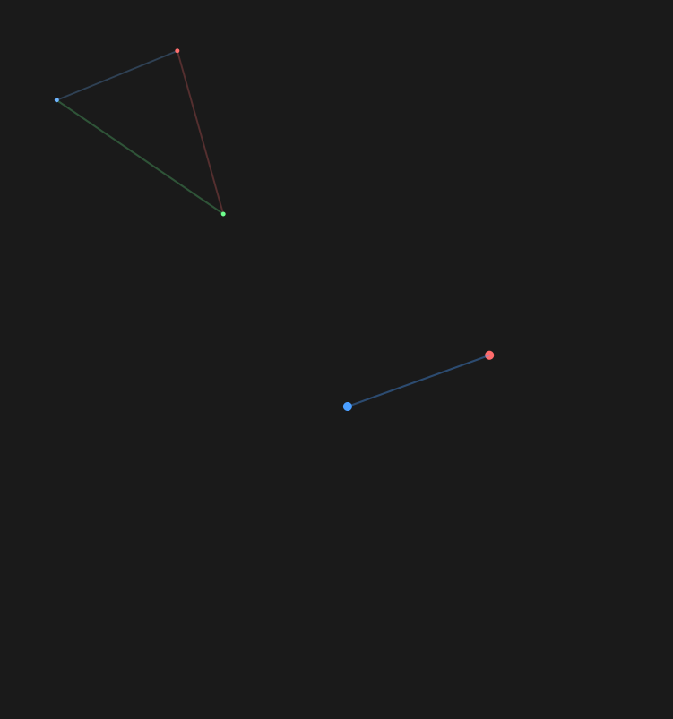
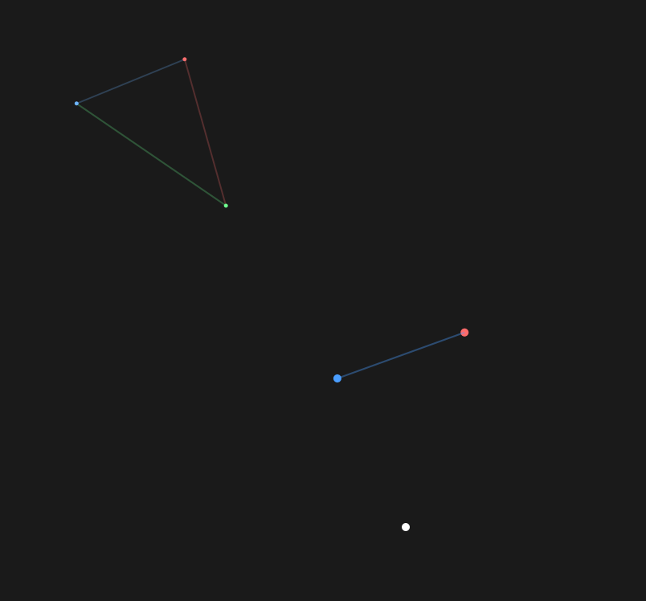
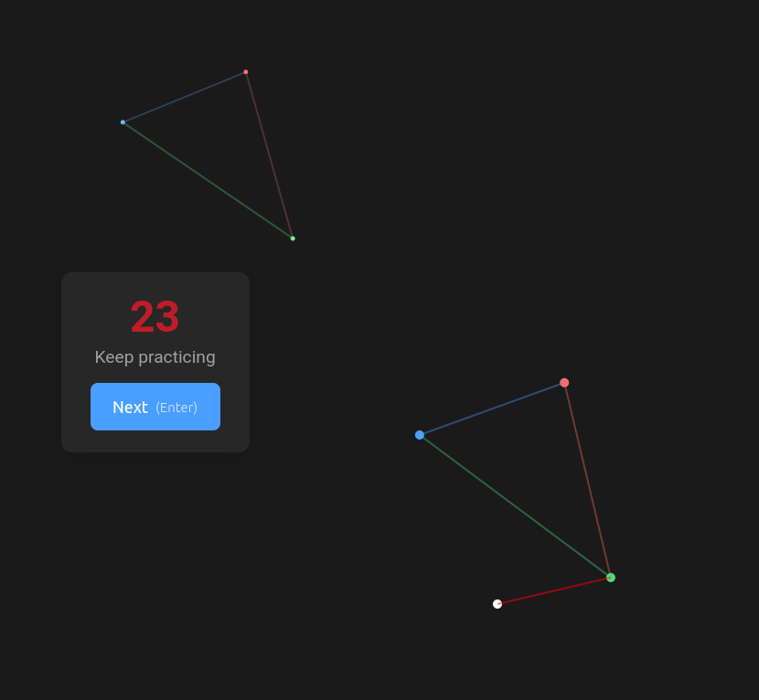

# Eye Gym

A visual training app to improve your ability to perceive and reproduce proportions. Train your eyes to recognize shapes regardless of rotation, scale, or position.

**Try it now:** [https://woumboum.github.io/eye-gym/](https://woumboum.github.io/eye-gym/)

Built with React 18, TypeScript, and Vite. Available as a PWA for offline use.

---

## How It Works

Eye Gym trains your visual perception through a simple but challenging exercise: **reproduce the shape of a triangle**.

### The Exercise

<table>
<tr>
<td width="33%" align="center">

<br/>
<b>1. The Setup</b>
</td>
<td width="33%" align="center">

<br/>
<b>2. Place Your Answer</b>
</td>
<td width="33%" align="center">

<br/>
<b>3. See the Result</b>
</td>
</tr>
</table>

### Step by Step

1. **Look at the model triangle** (light colors: light blue, light red, light green)
2. **Look at the incomplete triangle** (dark colors: dark blue and dark red points with a line)
3. **Place the green point** to complete the dark triangle with the same shape and proportions as the model
4. **Get instant feedback** showing your score and the correct position

The dark triangle can be:
- **Moved** to a different position
- **Scaled** to a different size
- **Rotated** to a different angle
- But **never flipped** (mirrored)

---

## Features

### Adaptive Learning

The app learns from your performance:
- **Struggling with certain positions?** You'll get more practice there
- **Mastered certain angles?** The app moves on to challenge you elsewhere
- **Exploration phase** ensures you try all parameter combinations before adaptation kicks in

### Multiple Profiles

- Create profiles for different users or training goals
- Switch between profiles instantly
- Export/import profiles as JSON files

### Detailed Statistics

- **Heatmaps** showing performance by position
- **Ratio curves** showing performance by triangle size ratios
- **Angle curves** showing performance by rotation angles
- **Timeline evolution** to visualize progress over time

### Additional Features

- **Dark mode** for comfortable training in low light
- **Adjustable timer** for time-pressure training
- **Keyboard shortcuts** (Enter/Space) for quick validation
- **PWA support** for installation on tablets
- **Bilingual** support (English/French)

---

## Quick Start

```bash
# Install dependencies
npm install

# Start development server
npm run dev

# Start with network access (for tablets on same WiFi)
npm run dev -- --host

# Build for production
npm run build
```

### Install on Tablet

1. Start with `npm run dev -- --host`
2. Connect your tablet to the same WiFi network
3. Open the displayed network URL (e.g., `http://192.168.x.x:5173`)
4. Use "Add to Home Screen" to install as a PWA

## Project Structure

```
src/
├── components/
│   ├── screens/        # MenuScreen, GameScreen, StatisticsScreen, etc.
│   ├── game/           # GameCanvas, ProgressBar
│   └── statistics/     # Heatmaps, curves, timeline
├── context/            # React Context for global state
├── hooks/              # useCanvas, useGameTimer, useTranslation
├── utils/              # geometry, gradients, sampling, scoring
├── i18n/               # Translations (EN/FR)
└── types/              # TypeScript definitions
```

---

## Contributing

Contributions are welcome! See [CLAUDE.md](CLAUDE.md) for codebase documentation and AI-specific instructions.

---

## License

MIT License - See [LICENSE](LICENSE) for details.

---

## Acknowledgments

- Built with [React](https://react.dev/) and [Vite](https://vitejs.dev/)
- PWA support via [vite-plugin-pwa](https://vite-pwa-org.netlify.app/)
